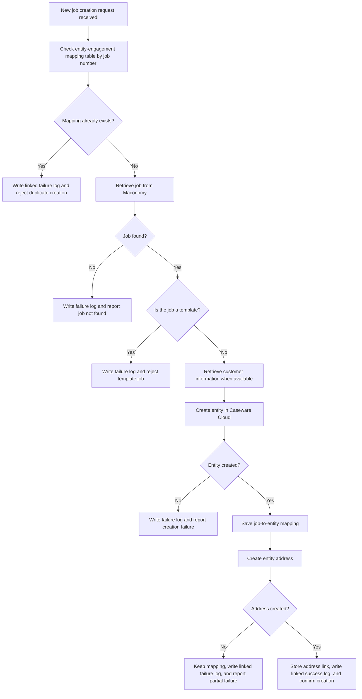

# Create New Job Functional Workflow

This diagram shows the functional workflow for creating a new Caseware
engagement from a Maconomy job.

## Functional rules

- The duplicate check reads the entity-engagement mapping table by job number.
  The integration-log table is not used to decide whether a job already exists.
- A job already linked to a Caseware entity cannot be created again, and the
  rejected attempt is recorded as a linked failure.
- The Maconomy job must exist. The template flag is then checked explicitly;
  jobs with `template = true` are rejected and recorded as failures.
- Customer information is used when available. Missing customer information
  does not prevent creation; unavailable address values remain empty.
- The job-to-entity link is saved immediately after the Caseware entity is
  created.
- If address creation fails, the entity and its job link remain in place, but
  the workflow records and reports a partial failure.
- Successful creation records a linked success and returns the Caseware entity
  identifiers.

Endpoint:
`POST /api/v1/caseware-cloud/on-create-engagement-post`
