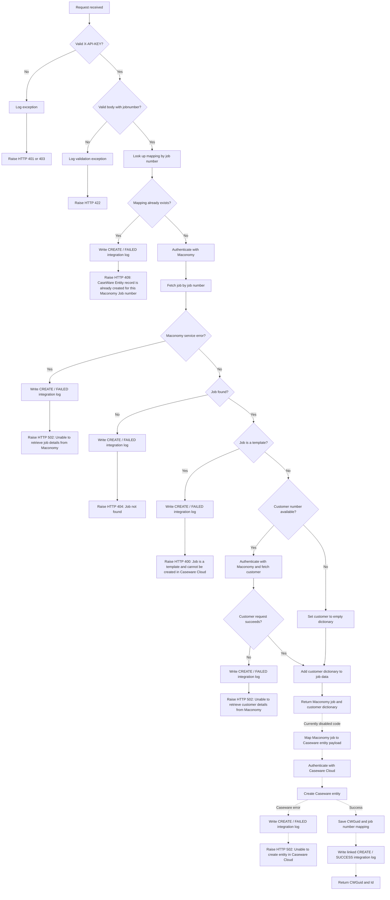

# Create Engagement Logic Flow

This diagram documents the current flow for
`_create_engagement(job_number, session)` used by:

```http
POST /api/v1/caseware-cloud/on-create-engagement-post
```



## Current behavior

The function currently returns the Maconomy job/customer dictionary after the
template validation. The Caseware entity creation, mapping insert, and success
log block below that return are commented out and therefore do not execute.

## Exception summary

| Condition | Integration log | HTTP status |
|---|---|---:|
| Missing API key | Generic exception log | 401 |
| Invalid API key | Generic exception log | 403 |
| Invalid request body | Generic exception log | 422 |
| Mapping already exists | `CREATE / FAILED` | 409 |
| Maconomy request fails | `CREATE / FAILED` | 502 |
| Job is not found | `CREATE / FAILED` | 404 |
| Job is a template | `CREATE / FAILED` | 400 |
| Caseware request fails | Disabled currently | 502 |
| Caseware entity is created | Disabled currently | 200 |

Unexpected database or application errors are handled by the global exception
handler, written to `exception_logs` when possible, and returned as HTTP 500.
