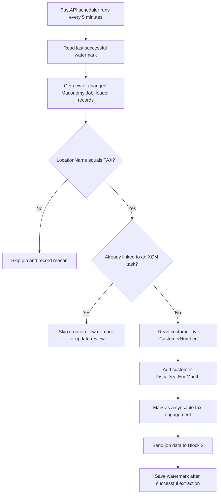

# Block 1 - Find Syncable Tax Engagements in Maconomy

## Purpose

Every five minutes, find new or changed Maconomy jobs and select the tax engagements that need CCH/XCM processing.

Block 1 works only with Maconomy. It does not search or create anything in CCH/XCM.

## Eligibility rule

```text
JobHeader.LocationName = "TAX"
```

Use a case-insensitive exact comparison against the stable Maconomy location code.

## Functional flow



## Maconomy fields to read

| Field | Purpose |
|---|---|
| `JobNumber` | Unique Maconomy engagement identifier |
| `LocationName` | Determines whether the engagement is TAX |
| `CustomerNumber` | Passed to Block 2 for CCH client/task matching |
| `TheYear` | Used later to calculate Period End Date |
| Customer `FiscalYearEndMonth` | Used later to calculate Period End Date |
| `Text20` or middleware mapping | Existing XCM `TaskInternalId`, if any |
| Last-modified value | Detects records changed after the previous run |

## How to identify an unsynced job

Prefer a middleware mapping table keyed by `JobNumber`. A job is unsynced when it has no successful XCM task mapping.

If Maconomy custom fields remain available, the reference-code equivalent is:

```text
JobHeader.Text20 is empty
```

## Output of Block 1

Block 1 outputs a queue/list of syncable tax engagements containing the data required by Block 2:

```text
JobNumber
CustomerNumber
TheYear
FiscalYearEndMonth
PeriodEndDate
Existing TaskInternalId, if any
```

Block 2 is responsible for searching, linking, or creating the CCH/XCM task.

## Current API

`POST /api/v1/xcm-cch-axcess/maconomy-tax-engagements/pending-cch-task-mapping`

The endpoint requires the standard `X-API-KEY` header and currently performs
Maconomy discovery only. It returns open, non-template jobs created today or
yesterday whose `LocationName` is an exact, case-insensitive match for `TAX`
and whose `Text20` value is null or an empty string. The `Text20` condition is
applied in the Maconomy restriction using `text20=''`. No XCM calls or
database mappings are performed in this block. For every distinct
`CustomerNumber`, the service builds a single Maconomy customer-filter
restriction joined with `or`. It indexes that response by customer number and
adds the returned `fiscalyearendmonth` to each matching job. Project fields are
not requested. Each job also receives a derived `periodenddate` in
`MM/DD/YYYY` format, using `theyear`, `fiscalyearendmonth`, and the last day of
that month. `fiscalyearendmonth` may be a numeric month or a month name such as
`december`.
