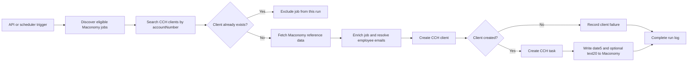
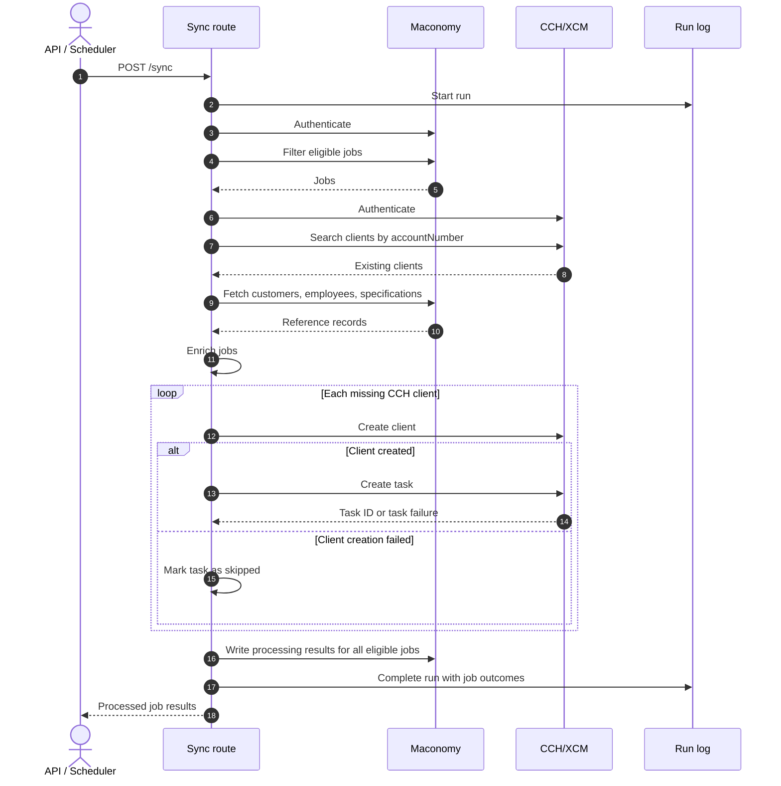
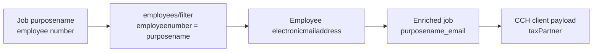
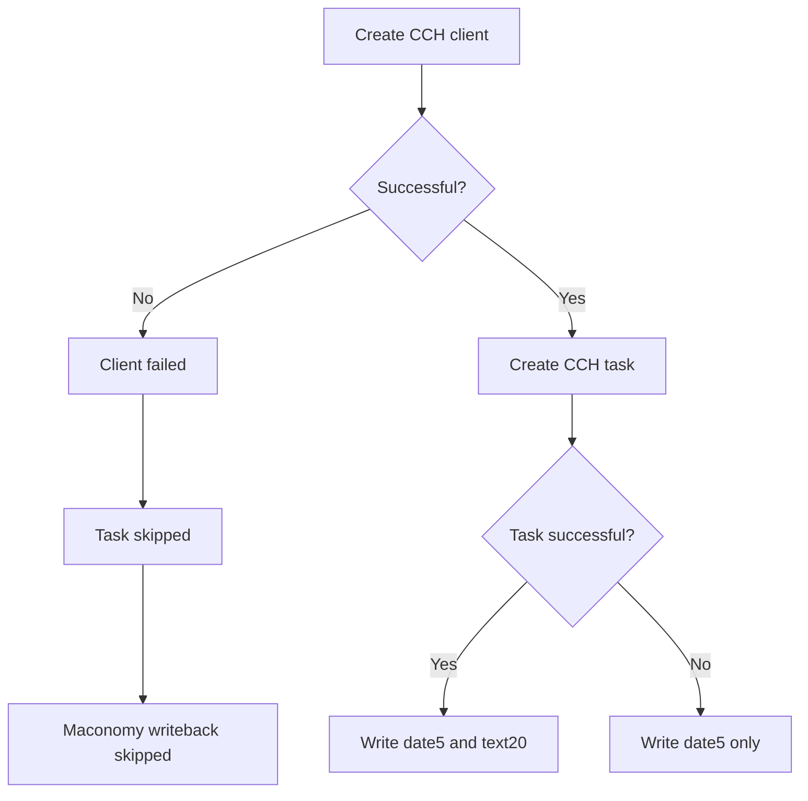
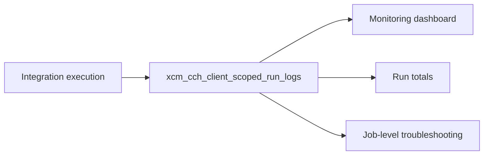

# Client-scoped Maconomy to CCH/XCM integration

## Purpose

This integration discovers eligible tax jobs in Maconomy and creates the
corresponding client and task in CCH/XCM. After CCH processing finishes, it
writes the processing result back to the Maconomy job and records a monitoring
run.

The integration is client-scoped: a Maconomy job is processed only when its
`jobnumber` does not already exist as a CCH client `accountNumber`.

## End-to-end flow



## API

### Endpoint

```http
POST /api/v1/xcm-cch-client-scoped/sync
X-API-KEY: <integration API key>
Content-Type: application/json
```

### Request

`jobnumbers` accepts an array of Maconomy job numbers or `null`.

```json
{
  "jobnumbers": ["12345", "67890"]
}
```

| Value | Behavior |
|---|---|
| Non-empty array | Processes only the requested job numbers |
| `null` | Performs scheduled discovery |
| Omitted | Same behavior as `null` |
| Empty array | Same behavior as `null` |

Direct requests are recorded with trigger type `API`. Scheduler requests are
recorded as `SCHEDULER`.

## Processing sequence



## Job discovery

The integration authenticates with Maconomy once per request and reuses the
reconnect token throughout the run. It calls the Maconomy `jobs/filter`
container with `limit: 5000` and `offset: 0`.

Every selected job must satisfy:

| Field | Required value |
|---|---|
| `template` | `false` |
| `locationname` | `2` |
| `closed` | `false` |
| `text20` | Empty |

When specific `jobnumbers` are supplied, they are added as grouped OR
conditions. Scheduled discovery applies the implementation's created-date
restriction instead.

Only the first 40 eligible jobs are passed to the CCH lookup in one request.

## Existing-client lookup

Maconomy `jobnumber` maps to CCH `accountNumber`. Job numbers are searched in
batches of 20 through:

```http
POST /xcmrestservices/vnext/api/v2/Client/search/advanced
```

Each batch uses OR filters, `pageIndex: 1`, and a result count equal to the
batch size plus a 50-result buffer. Only exact `accountNumber` matches are
treated as existing clients.

Jobs with an existing CCH client are excluded. This integration does not
update existing CCH clients.

## Reference-data enrichment

Reference data is fetched only for jobs that do not already exist in CCH.

| Maconomy container | Lookup values | Returned fields |
|---|---|---|
| `customercard/filter` | `customernumber` | `customernumber`, `name1`, `fiscalyearendmonth` |
| `employees/filter` | `projectmanagernumber`, `specification5name`, `employeenumber6`, `purposename` | `employeenumber`, `electronicmailaddress` |
| `specification1/filter` | All records | `specification1name`, `description` |
| `specification2/filter` | All records | `specification2name`, `description` |

Customer and employee requests use `limit: 5000`. Specification requests use
`limit: 1000`. All requests use `offset: 0` and reuse the same Maconomy
authentication token.

### Tax-partner resolution

Maconomy `purposename` contains an employee number, not an email address. The
integration resolves that employee number before building the CCH payload.



The exact mapping is:

```text
job.purposename
    -> employee.employeenumber
    -> employee.electronicmailaddress
    -> job.purposename_email
    -> CCH taxPartner
```

If `purposename` is empty, no employee matches, or the matched employee has no
email, `purposename_email` and `taxPartner` are `null`. The integration does
not currently stop the job before the CCH request in this situation.

## Enriched job fields

| Enriched field | Source |
|---|---|
| `fiscalyearendmonth` | Matching customer `fiscalyearendmonth` |
| `periodenddate` | Last day of `theyear` and `fiscalyearendmonth`, formatted `MM/DD/YYYY` |
| `specification1_description` | Matching Specification 1 description |
| `specification2_description` | Matching Specification 2 description |
| `projectmanager_email` | Project manager employee email |
| `employee6_email` | Employee 6 email |
| `spec5_email` | Specification 5 employee email |
| `purposename_email` | Purpose employee email used for the tax partner |

Numeric months, full month names, and abbreviated month names are accepted for
`periodenddate`. Missing or invalid reference values produce `null`.

## CCH client creation

New clients are posted to:

```http
POST /xcmrestservices/vnext/api/v2.1/Client
```

### Client field mapping

| CCH field | Maconomy or enriched value |
|---|---|
| `responsiblePerson` | `employee6_email` |
| `emailId` | `electronicmailaddress` |
| `last_Entity_Name` | `name1` |
| `clientType` | `Individual` when Specification 1 description is `individual`; otherwise `Entity` |
| `phoneNumber` | `telephone` |
| `accountNumber` | `jobnumber` |
| `originatingLocationName` | Constant `HQ` |
| `active` | Constant `Y` |
| `primaryTask` | `specification2_description` |
| `periodEndDate` | `periodenddate` |
| `auditPartner` | `spec5_email` |
| `taxPartner` | `purposename_email` |

## CCH task creation

A task is created only after its client is created successfully:

```http
POST /xcmrestservices/vnext/api/v2/Task
```

| CCH task field | Source |
|---|---|
| `accountNumber` | `jobnumber` |
| `taskType` | `specification2_description` |
| `periodEndDate` | `periodenddate` with `00:00:00` appended |
| `taskDescription` | `description1`, falling back to `jobnumber` |

When the Specification 2 description is blank, `taskType` defaults to
`Tax - 1040 Individual`.

The integration does not search for an existing task because task creation is
performed only for a newly created CCH client.

## Result handling

Each returned job contains `cchclientcreation` and `cchtaskcreation` status
objects. A failure for one job does not stop later jobs.



## Maconomy writeback

CCH processing finishes for the selected jobs before the separate Maconomy
writeback phase begins. Each eligible job receives at most one Maconomy card
update.

| CCH result | Maconomy update |
|---|---|
| Client created and task created | Write `date5` and `text20` together |
| Client created and task failed or skipped | Write only `date5`; leave `text20` unchanged |
| Client creation failed | Skip Maconomy update |

`date5` receives `periodenddate`, converted from `MM/DD/YYYY` to `YYYY-MM-DD`.
`text20` receives the CCH `taskId` only when task creation succeeds.

Before writing, the integration confirms that the Maconomy job
`versionnumber` has not changed. After writing, it reads the job again and
verifies the version and saved values.

Each response job reports `maconomywritebackstatus` as `updated`, `failed`, or
`skipped`. This status is returned by the API and is not stored in a Maconomy
field.

## Run logging and monitoring

Every execution creates one row in `xcm_cch_client_scoped_run_logs`.

The run log contains:

- Request ID and trigger type
- Overall status and Maconomy instance
- Start and completion timestamps
- Jobs discovered, succeeded, and failed
- Clients and tasks created
- Maconomy writebacks
- Structured success and failure details

The structured `details` value includes discovered and successful job-number
lists and, for each failed job, the failure stage, reason, and stages completed
before the failure.



The monitoring summary follows this format:

```text
10 jobs discovered to sync; 5 succeeded [job numbers];
5 failed [job number: failure reason]
```

## Failure stages

| Stage | Meaning |
|---|---|
| `MACONOMY_DISCOVERY` | Maconomy authentication or job discovery failed |
| `CCH_CLIENT_LOOKUP` | CCH authentication or existing-client lookup failed |
| `MACONOMY_REFERENCE_DATA` | Customer, employee, or specification lookup failed |
| `CCH_AUTHENTICATION` | CCH processing could not start or complete at the route level |
| `MACONOMY_WRITEBACK` | The route-level Maconomy writeback operation failed |

Individual client, task, and job writeback failures are isolated and included
in the processed job result whenever processing can continue.

## Main implementation files

| File | Responsibility |
|---|---|
| `routers/sync_router.py` | Orchestrates the integration and run logging |
| `services/maconomy_service.py` | Maconomy authentication, discovery, enrichment, and writeback |
| `services/cch_client_service.py` | CCH authentication, client lookup, client creation, and task creation |
| `services/integration_run_log_service.py` | Persists run-level and job-level monitoring details |
| `models/integration_run_log.py` | Defines the monitoring log table |

## Current operational limits

- A request sends at most 40 eligible jobs to the CCH lookup.
- Maconomy filter calls do not paginate beyond their configured limit.
- Existing CCH clients are detected and excluded; they are not updated.
- A missing purpose employee email results in `taxPartner: null` rather than an
  integration-side validation failure.
- The client-scoped integration has its own service switch and is independent
  of the older CCH task-mapping integration.
