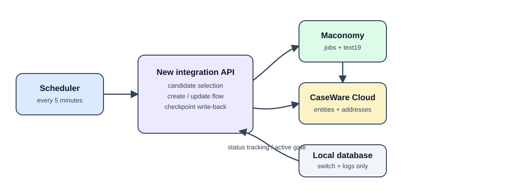
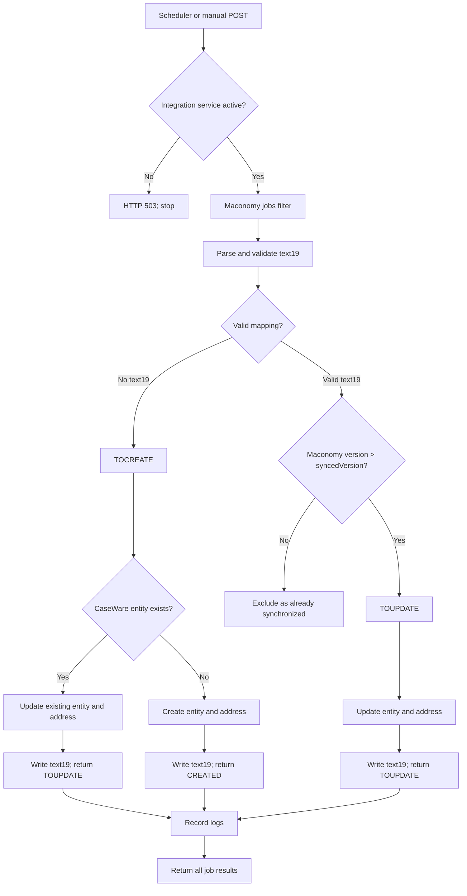

# Maconomy to CaseWare Cloud integration

This document describes the Maconomy-first CaseWare Cloud integration in
`app/features/maconomy_caseware_cloud_intergration`.

## Purpose and ownership

Maconomy is the source of truth for the job and its CaseWare identifiers. The
Maconomy job field `text19` stores the synchronization checkpoint. The local
database has two separate responsibilities:

- The `integration_service` row controls whether this integration is active.
- The `maconomy_caseware_cloud_request_logs` table records request and job
  outcomes for troubleshooting.

The database does not decide whether a job needs synchronization. That decision
comes from the Maconomy job version and the checkpoint in `text19`.



## Entry points and scheduling

The endpoint is:

```text
POST /api/v1/maconomy-caseware-cloud/sync-jobs
```

It requires the existing `X-API-KEY` and the database-backed integration
service `MACONOMY_CASEWARE_CLOUD_SYNC` to be active. The service is registered
by migration `20260916_0010` and is inactive by default. The same gate protects
manual calls and scheduled calls.

When `SCHEDULER_ENABLED=true`, the application starts one APScheduler job from
the FastAPI lifespan. It calls the endpoint every five minutes by default:

```text
SCHEDULER_ENABLED=true
SCHEDULER_INTERVAL_MINUTES=5
SCHEDULER_API_BASE_URL=http://127.0.0.1:8000
SCHEDULER_API_KEY=<same API key accepted by the application>
```

The scheduler has one active job, `maconomy_caseware_cloud_sync`, and calls only
this endpoint. If the integration-service row is inactive or missing, the
endpoint returns HTTP 503 and no Maconomy or CaseWare work starts.

## Complete processing flow



Each candidate is processed independently. A failure marks only that job as
`FAILED` with `syncError`; the loop continues. A failure fetching the initial
Maconomy candidate list returns HTTP 502 because there is no list to process.

## Candidate selection in Maconomy

The endpoint posts to the Maconomy jobs container filter. It selects jobs that
are open and non-template and whose `createddate` or `changeddate` is yesterday
or today, using the application server's local date:

```text
template=false and closed=false and
((createddate>=yesterday and createddate<=today) or
 (changeddate>=yesterday and changeddate<=today))
```

The request limit is 2,000. It fetches the fields used by the entity and address
payloads plus the synchronization fields:

```text
jobnumber, jobname, name1, name2, name3, name4, postaldistrict,
country, customernumber, template, closed, versionnumber,
createddate, changeddate, text19
```

When this produces at least one candidate, the endpoint calls the Maconomy
`countries/filter` API once with the `name` and `isocode` fields. Country names
are matched case-insensitively after trimming whitespace. The resulting map is
reused for every candidate in that request and is not fetched when the candidate
list is empty. A job whose country cannot be mapped fails independently without
stopping the remaining jobs.

## `text19` checkpoint contract

Maconomy stores `text19` as a string containing compact JSON. The endpoint
parses it into an object for its response. Empty, null, malformed, incomplete,
or invalid values are treated as no mapping and become `TOCREATE`.

```json
{
  "entityId": "fb32dd0d-2536-4c06-b27a-3bb2b5ad03a9",
  "entityNo": "VSKY-10105",
  "syncedVersion": 26,
  "addressId": "21bd2890-bbca-46f4-9717-38c4b1902587",
  "addressNo": 10164,
  "lastUpdateOnUTC": "2026-09-16T14:14:51.389778Z"
}
```

`entityId` and `addressId` are CaseWare `CWGuid` values. `addressId` and
`addressNo` are null only when no address exists yet. `addressNo` is the
CaseWare address `Id`, which is normally numeric. `syncedVersion` is a
non-negative integer and `lastUpdateOnUTC` is a UTC ISO timestamp.

For a valid mapping, the endpoint keeps the job only when:

```text
Maconomy versionnumber > text19.syncedVersion
```

Jobs at or below the checkpoint are omitted. Jobs with no mapping remain in the
final list as `TOCREATE`.

## Authentication and request safety

Maconomy's X-Reconnect token and CaseWare's bearer token are cached in memory
for 29 minutes, below their 30-minute lifetime. Concurrent requests share an
authentication lock. A rejected cached token is cleared and the request is
retried once with a new token.

The endpoint allows one candidate batch per application process at a time. The
Maconomy write sequence uses a fresh instance and the latest concurrency token:

1. POST `/jobs/instances` and read `containerInstanceId` plus the concurrency
   token.
2. Bind the job with `/instances/{instanceId}/data;jobnumber={jobnumber}`.
3. Verify the expected source version and checkpoint value.
4. POST `/data/panes/card/0` with the serialized `text19` and the bind token.
5. Bind the job again and verify the saved JSON and one-version increment.

CaseWare 429 responses use `Retry-After` when present, otherwise 2, 4, and 8
second backoff delays. The retry limit is bounded; after it is exhausted only
the current job fails.

## Existing entity mapping (`TOCREATE` with a match)

The endpoint searches CaseWare with the exact query:

```text
GET /api/v2/entities?search=EntityNo='VSKY-{jobnumber}'&page=1&pageSize=50
```

When one matching entity exists, no duplicate entity is created. The
integration immediately updates that CaseWare entity with the latest Maconomy
job data, then updates or creates its address. If the response includes an
address, its `CWGuid` and numeric `Id` supply `addressId` and `addressNo`.

Only after the CaseWare entity and address are current are their identifiers
written to `text19`. The checkpoint stores `syncedVersion` as the source
Maconomy version plus one, matching the Maconomy version after the `text19`
write. The response action remains `TOUPDATE` to identify the update workflow;
the job is excluded on the next run until Maconomy reports a newer version.

## New entity creation (`TOCREATE` without a match)

The entity payload follows the established CaseWare rules:

```json
{
  "Id": 0,
  "EntityNo": "VSKY-{jobnumber}",
  "Name": "{jobname}",
  "OwnerType": "Client",
  "CountryCode": "{Maconomy country ISO code}",
  "OperatingName": "{jobname}",
  "OrganizationType": "Corporation",
  "Type": "A"
}
```

The address is created below the entity using `name1` through `name4`,
`postaldistrict`, the Maconomy country name in `Country`, the matching ISO code
in `CountryCode`, and `AddressCategory = Business`. The created
numeric address `Id` is resolved back to its `CWGuid` by reading the entity's
addresses. Only after both operations succeed is `text19` written. Since the
CaseWare data is already current, the checkpoint stores `syncedVersion` as the
source Maconomy version plus one, matching the version after the text19 write.
The response action is `CREATED`.

If the entity is created but address creation fails, the job is `FAILED` and no
checkpoint is written. A later run finds the existing entity and performs the
full update-and-checkpoint path.

## CaseWare update (`TOUPDATE`)

For a valid mapping with a newer Maconomy version, the endpoint:

1. Reads the mapped CaseWare entity by `entityId`.
2. PATCHes `Name`, `OperatingName`, `OwnerType`, `Type`, and the resolved
   `CountryCode` from the Maconomy job.
3. Reads the entity's addresses.
4. If `addressId` is mapped, PATCHes that exact address. If it is empty and an
   address exists, PATCHes and adopts the first address. If no address exists,
   creates one.
5. Stores the resulting address `CWGuid` and `Id` in the checkpoint.
6. Writes the new checkpoint to Maconomy with `syncedVersion = source version +
   1`, because the write increments `versionnumber`.

The Maconomy checkpoint is written only after CaseWare operations succeed. If
Maconomy changed during the CaseWare work, the checkpoint write is rejected and
the job is returned as `FAILED`; the next run can retry it.

## Request and job logging

After the candidate loop finishes, the endpoint appends records to
`maconomy_caseware_cloud_request_logs`:

- One row per processed candidate, with its action, status, job number, message,
  version, and checkpoint details.
- One batch row with the request ID, total processed count, succeeded count, and
  failed count.

The request ID comes from the existing request middleware. The Maconomy
shortname is stored as `maconomy_instance`. Logging is best-effort: a logging
transaction is rolled back if it fails, and the sync response is not changed.
These rows are for diagnosis only and are never read to decide whether a job is
created, updated, or excluded.

## Operational outcomes

The response is an array of candidate records. Common final actions are:

| Action | Meaning |
| --- | --- |
| `CREATED` | New CaseWare entity and address created; checkpoint saved. |
| `TOUPDATE` | Existing mapping was adopted or CaseWare data was updated. |
| `FAILED` | This job could not complete; inspect `syncError` and request logs. |

Jobs already synchronized by their version checkpoint are omitted from the
response. The scheduler retries them on a later date window when Maconomy
reports a newer change.

## Code locations

```text
backend/app/features/maconomy_caseware_cloud_intergration/
  routers/sync_router.py
  services/maconomy_service.py
  services/caseware_service.py
  services/request_log_service.py
  models/request_log.py

backend/app/features/schedular_services/
  scheduler.py
  services/maconomy_caseware_sync.py

backend/alembic/versions/
  20260916_0009_maconomy_caseware_request_logs.py
  20260916_0010_register_maconomy_caseware_cloud_service.py
```
