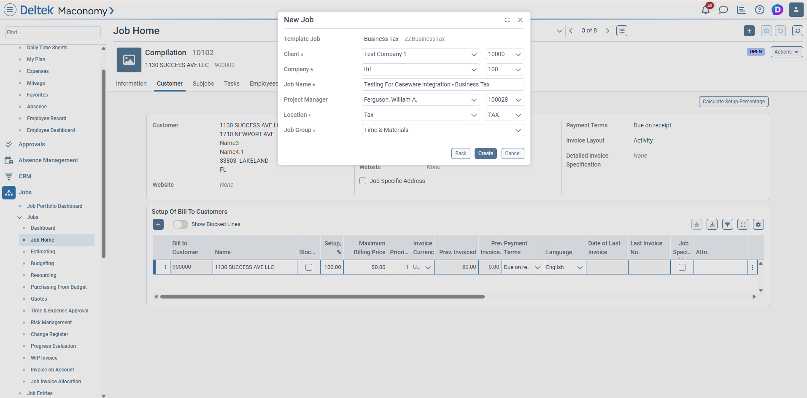
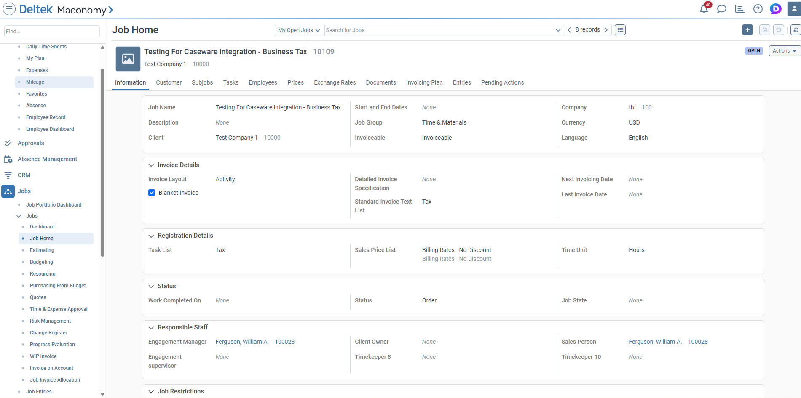
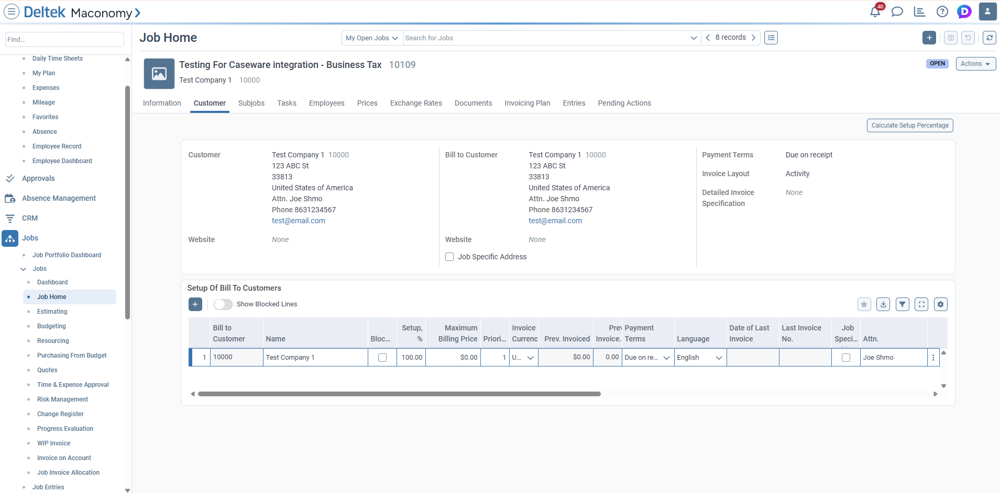
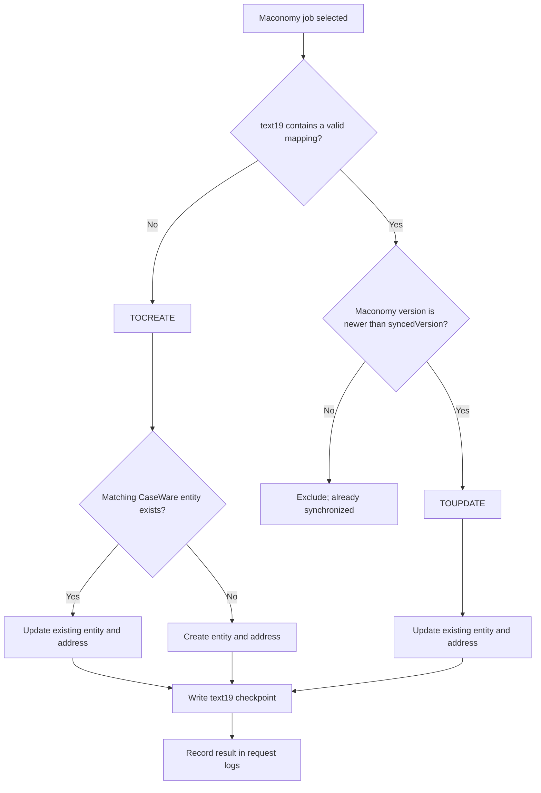
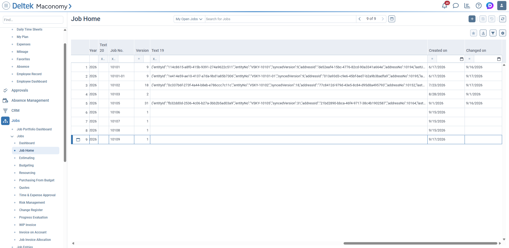

# Maconomy to CaseWare Cloud Integration

## Integration scope and field coverage

This delivery synchronizes open Maconomy jobs with their corresponding CaseWare
Cloud client entity and one business address. It supports scheduled processing
of recently created or changed jobs and a manual, single-job retry. Maconomy is
the source of truth; the local database only controls service activation and
stores execution status for support.

### Maconomy fields in scope

| Maconomy field | Purpose in the integration |
| --- | --- |
| `jobnumber` | Finds the CaseWare entity using `VSKY-{jobnumber}`. |
| `jobname` | Sets the CaseWare entity name and operating name. |
| `name1` | Sets the address name. |
| `name2`, `name3`, `name4` | Set address lines 1, 2, and 3. |
| `postaldistrict` | Sets the address city. |
| `country` | Sets the address country name and is matched to Maconomy's ISO code for the CaseWare entity and address. |
| `template`, `closed` | Exclude template and closed jobs. |
| `createddate`, `changeddate` | Select recent jobs for the scheduled run. |
| `versionnumber` | Determines whether CaseWare needs a newer version. |
| `text19` | Stores CaseWare IDs, numbers, synchronized version, and UTC timestamp. |

The integration applies the following standard CaseWare values: entity owner
`Client`, entity type `A`, organization type `Corporation`, and address category
`Business`. The entity and address country code comes from the ISO code assigned
to the Maconomy country name.

### Scope boundaries

This delivery includes entity creation and updates, creation or updates of the
single associated business address, Maconomy `text19` write-back, scheduled and
manual triggers, version checks, token reuse, rate-limit handling, and status
logging. It does not include other Maconomy record types, additional CaseWare
modules or related records such as contacts, phones, emails, documents,
workflow, or billing, changes to unrelated Maconomy business data, or changes to
CaseWare screens. Any additional data or process can be assessed separately so
that it receives clear requirements and delivery timing.

## Integration workflow and behavior

This section explains how an in-scope Maconomy job is synchronized with
CaseWare Cloud, how the two systems remain connected, and what happens when a
job is created or changed.

The integration uses Maconomy as the source of truth. Maconomy owns the job
information and stores the CaseWare entity and address identifiers in the
job's `text19` field. The local integration database controls whether the
service is active and stores execution history for support and troubleshooting.
It is not used to decide whether a job needs synchronization.

The CaseWare Cloud system is accessed through APIs, so this guide explains its
requests and responses using endpoint examples rather than CaseWare screen
images.

The scheduled batch endpoint is:

```text
POST /api/v1/maconomy-caseware-cloud/sync-jobs
```

For a one-off synchronization, an authorized caller can use the separate
job-number endpoint:

```text
POST /api/v1/maconomy-caseware-cloud/sync-job
{
  "jobnumber": "10105"
}
```

This endpoint is intended for manual checking and recovery when a scheduled
run reports a failed job. It reads and processes only the supplied Maconomy job;
it does not process the rest of the job list. It applies the same create, map,
update, address, checkpoint, version, and logging rules as the scheduled batch
endpoint.

Support can use it to retry a failed job after correcting the underlying data
or service issue. A successful response shows the final action and the updated
`text19` checkpoint. A missing Maconomy job returns HTTP 404. A processing
failure returns the job with `syncAction: "FAILED"` and a `syncError` message,
and the attempt is recorded in the request log for follow-up.
If the job is already synchronized according to its version checkpoint, the
response action is `ALREADY_SYNCED` and no CaseWare update is required.

## How the integration starts

The integration runs automatically from the scheduler every five minutes when
the service is active. It can also be called manually by an authorized caller.

Before any synchronization begins, the integration checks the service status in
the database. If the service is inactive, no Maconomy or CaseWare operation is
performed.

The service status is controlled by the `integration_service` database record
described in the scheduler and service configuration section above.

## How jobs are selected

The integration asks Maconomy for jobs that meet all of these conditions:

- The job is not a template.
- The job is not closed.
- The job was created or changed today or yesterday.

The response includes the job details needed to update CaseWare, including the
job name, address fields, Maconomy version, and `text19`.

When at least one job requires creation or update, the integration reads the
Maconomy country list once for that request. It matches each job's country name
to the corresponding two-letter ISO code and reuses the list for all jobs in
the batch. No country-list request is made when there is no work to synchronize.



The job is created in Maconomy from the completed New Job form. The job name,
client, company, project manager, location, and job group are captured before
the integration can process the job.



The new job is then available in Maconomy's Job Home. The Information tab shows
the created job number, job name, client, company, and other job details used by
the integration.



The Customer tab provides the customer and address data used to create or
update the CaseWare address record.

## Maconomy data used in CaseWare Cloud

The integration reads information from the Maconomy job and sends it to two
functional areas in CaseWare Cloud: the entity record and the entity address.
The same values are used when an entity is created and when it is updated.

### CaseWare entity

The entity is the organization or client record in CaseWare Cloud.

| Maconomy information | CaseWare entity field | Functional meaning |
| --- | --- | --- |
| Job Name (`jobname`) | `Name` | The name displayed for the client or organization. |
| Job Name (`jobname`) | `OperatingName` | The operating or trading name used by the entity. |
| Job Number (`jobnumber`) | `EntityNo` as `VSKY-{jobnumber}` | The unique reference used to find the same entity later. |
| — | `OwnerType = Client` | Identifies the CaseWare entity as a client. |
| — | `Type = A` | Sets the CaseWare entity type required by the integration. |
| — | `OrganizationType = Corporation` | Sets the standard organization classification during creation. |
| Country (`country`) matched with the Maconomy country list | `CountryCode` | Sets the two-letter ISO country code during entity creation and updates. |

The job number is the link between the two systems. For example, Maconomy job
`10105` is searched in CaseWare as entity number `VSKY-10105`.

### CaseWare entity address

The address is stored below the CaseWare entity and represents the customer
address shown on the Maconomy Customer tab.

| Maconomy information | CaseWare address field | Functional meaning |
| --- | --- | --- |
| Customer name (`name1`) | `Name` | The name shown for the address or customer location. |
| Address line 1 (`name2`) | `Address1` | The first street or address line. |
| Address line 2 (`name3`) | `Address2` | The second address line, when provided. |
| Address line 3 (`name4`) | `Address3` | The third address line, when provided. |
| City or postal district (`postaldistrict`) | `City` | The city or locality. |
| Country (`country`) | `Country` | The country name from the Maconomy job. |
| Country (`country`) matched with the Maconomy country list | `CountryCode` | The corresponding two-letter ISO country code. |
| — | `AddressCategory = Business` | Identifies the address as a business address. |

When an address is created, CaseWare returns an address number (`Id`) and a
unique address identifier (`CWGuid`). Both are saved in Maconomy `text19` so
the same address can be updated later. If the job has no CaseWare address yet,
the integration creates one using the values above. If an address is already
mapped, the integration updates that address.

### Synchronization and control information

These Maconomy values control when the integration works on a job. They are not
business data sent to the visible CaseWare entity or address fields.

| Maconomy information | How it is used |
| --- | --- |
| `template` | Template jobs are excluded. |
| `closed` | Closed jobs are excluded. |
| `createddate` | A newly created job is considered during the current two-day window. |
| `changeddate` | A changed job is considered during the current two-day window. |
| `versionnumber` | Compared with `text19.syncedVersion` to identify newer Maconomy data. |
| `text19` | Stores the CaseWare entity/address mapping and synchronized version. |

The integration does not copy the internal `versionnumber` into a CaseWare
business field. It uses that value only to know whether CaseWare needs the
latest Maconomy information.

The Maconomy customer number, job dates, template flag, closed flag, and
version are used for selection and synchronization control. They are not
written into the visible CaseWare entity or address business fields.

## How the integration decides what to do

The decision is based on `text19` and the Maconomy version.



## New job or missing CaseWare entity

For a `TOCREATE` job, the integration searches CaseWare using the job number:

```text
EntityNo = VSKY-{Maconomy job number}
```

If no matching entity exists, the integration creates the CaseWare entity and
its first address. The address is then read back so both the numeric address
number and address `CWGuid` can be saved in Maconomy.

The entity uses the Maconomy job name and standard integration values. The
address uses the Maconomy name, street, city, country, and postal information.

After successful creation, the Maconomy `text19` field contains the mapping:

```json
{
  "entityId": "CaseWare entity CWGuid",
  "entityNo": "VSKY-job number",
  "syncedVersion": "Maconomy version after text19 write",
  "addressId": "CaseWare address CWGuid",
  "addressNo": "CaseWare address Id",
  "lastUpdateOnUTC": "UTC timestamp"
}
```

The response action is `CREATED`.

## Existing CaseWare entity

If the CaseWare entity already exists, the integration does not create a
duplicate. It immediately updates the CaseWare entity with the latest Maconomy
job data. It then updates the existing address or creates an address when the
entity has none.

The entity and address identifiers are written to Maconomy only after the
CaseWare data is current. The response action is `TOUPDATE`, identifying the
update workflow that was completed.

CaseWare Cloud is accessed through its entity and address APIs; no CaseWare
Cloud user-interface screenshot is required for this integration.

## Maconomy updates

When `text19` already contains a mapping and the Maconomy version is newer than
`syncedVersion`, the integration updates the mapped CaseWare entity and address.

The Maconomy version is checked again immediately before writing `text19`. This
prevents a newer Maconomy change from being overwritten. The checkpoint is
stored as a stringified JSON value because `text19` is a string field.



After CaseWare synchronization, the Maconomy jobs list shows the stringified
JSON checkpoint in the `Text 19` column. This contains the CaseWare entity and
address identifiers used by later update runs.

Writing `text19` increases the Maconomy version by one. The integration stores
the corresponding synchronized version so the next scheduler run can exclude
the job until Maconomy reports another change.

## Authentication and reliability

Maconomy and CaseWare authentication tokens are reused for up to 29 minutes,
within their 30-minute lifetime. This avoids logging in separately for every
job.

CaseWare rate-limit responses are retried using the server's `Retry-After`
value, or a bounded 2, 4, and 8 second backoff when that value is unavailable.
Each job is processed independently. If one job fails, its error is returned
and recorded while the remaining jobs continue.

## Status and troubleshooting

At the end of a synchronization request, the integration records:

- One status row for each processed job.
- One summary row for the complete request.
- The request ID, job number, action, status, message, Maconomy version, and
  checkpoint details.

Typical outcomes are:

| Outcome | Meaning |
| --- | --- |
| `CREATED` | CaseWare entity and address were created and mapped. |
| `TOUPDATE` | CaseWare data was updated using the Maconomy job. |
| `FAILED` | The job could not complete; review the error and request log. |

The logs are used for support and troubleshooting only. They do not control
whether a job is synchronized.

## Support sequence

When investigating a job, support can review the following in order:

1. Confirm the integration service is active.
2. Check the Maconomy job's `versionnumber` and `text19`.
3. Check the CaseWare entity using `entityId` or `entityNo`.
4. Check the CaseWare address using `addressId` or `addressNo`.
5. Review the request and job status logs using the request ID.
