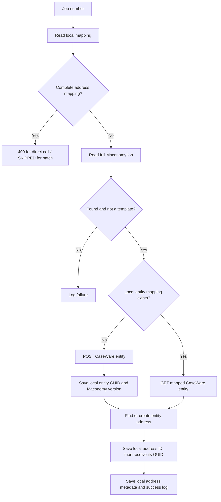
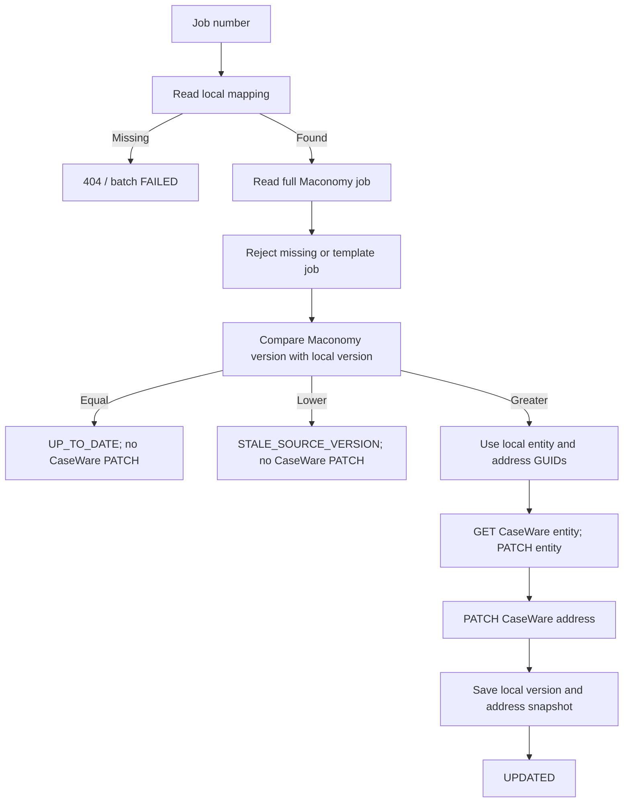

# Current Maconomy to CaseWare Cloud data flow

This is a code-based description of the four processing endpoints as they exist
today. Each endpoint requires `X-API-KEY` and an active integration-service
record. The Maconomy jobs container supplies job and customer/address values;
CaseWare Cloud receives one entity and one address per job. No CaseWare ID or
last-synced checkpoint is currently read from or written to Maconomy.

| Path | Trigger and Maconomy selection | Shared processing | Result |
| --- | --- | --- | --- |
| `POST /api/v1/caseware-cloud/on-create-engagement-post` | A caller supplies `jobnumber`; the full job is fetched by number. | `_create_engagement` | CaseWare entity `CWGuid` and `Id`, or an HTTP error. A complete local mapping gives 409. |
| `POST /api/v1/caseware-cloud/sync-todays-created-maconomy-engagements-with-caseware` | Scheduler/manual call; selects non-template jobs created **yesterday or today** (server-local dates), limit 2,000. | Calls `_create_engagement` sequentially for each returned `jobnumber`. | Per-job `SUCCESS`, `SKIPPED`, or `FAILED`; missing job numbers are omitted. |
| `POST /api/v1/caseware-cloud/on-update-engagement-post` | A caller supplies `jobnumber`; the full job is fetched by number **after** local mapping lookup. | `_detect_engagement_update` | `UPDATED`, `UP_TO_DATE`, `STALE_SOURCE_VERSION`, or an HTTP error. Missing local mapping gives 404. |
| `POST /api/v1/caseware-cloud/sync-recently-updated-maconomy-engagements-with-caseware` | Scheduler/manual call; selects non-template jobs changed **yesterday or today** (server-local dates), limit 2,000. | Calls `_detect_engagement_update` sequentially for each returned `jobnumber`; each candidate is fetched again in full. | Per-job version status or `FAILED`; a missing job number becomes a `FAILED` item. |

The in-process scheduler is disabled by default. When enabled, its default
interval is five minutes, and it calls the created batch before the updated
batch. A failed HTTP call in one step does not stop the other. Each batch
continues after a per-job error; a failed initial Maconomy filter call aborts
that batch request. The date restriction selects candidates only: the full job
is fetched by `jobnumber` before processing.

## Create: new and partially completed jobs

The full Maconomy job provides `jobnumber`, `jobname`, `name1` through `name4`,
`postaldistrict`, `country`, `customernumber`, `template`, and `versionnumber`.
The entity maps `jobnumber` to CaseWare `EntityNo` with a `Vsky-` prefix,
`jobname` to `Name` and `OperatingName`, and fixed entity type values. The
address maps the job's `name1` through `name4`, postal district, and country.
The creation response supplies entity `CWGuid` and numeric `Id`. Address
creation supplies numeric `Id`; the service lists addresses to find its
`CWGuid`. These IDs and the job version are committed only to the local mapping
table. Integration logs are also committed locally.

The local job version is saved immediately after entity creation, before the
address has been confirmed. An address failure can therefore leave a local row
with a current version but an incomplete address. The direct create endpoint
will resume that row; the update endpoint still requires a complete address
GUID and will fail until creation is resumed.

If a local entity mapping exists but its address is incomplete, creation resumes
using the mapped entity. It uses a saved address ID when present, otherwise
adopts the entity's sole existing address or creates a new one. Multiple
existing addresses require manual resolution. An uncertain entity-creation
result is reconciled by looking up CaseWare `EntityNo`, but the lookup currently
uses the **raw** job number while creation writes `Vsky-{jobnumber}`. That
mismatch can prevent recovery of a successfully created entity.

## Update: changed Maconomy jobs

The version comparison uses the full job's `versionnumber` against
`caseware_cloud_entity_engagement_mapping.maconomy_job_version_number`. The
address GUID comes from the sole entry in local `cw_addresses`. The entity
PATCH updates `Name`, `OperatingName`, `OwnerType`, and `Type`. The address
PATCH updates `Address1` through `Address3`, `AddressCategory`, `City`,
`Country`, and `Name`. The local version/address snapshot is advanced only
after both PATCH calls succeed. If the address PATCH fails after the entity
PATCH succeeds, the next run retries both PATCH calls.

The local mapping is currently the gate for both existence and version state.
Consequently, a CaseWare entity that exists but has no local row cannot be
updated; an equal local version suppresses updates without checking any
Maconomy-owned checkpoint. The update path has no ability to create an entity
for a candidate that has never been synchronized.

## Code references

- `app/features/caseware_cloud_intergration/routers/create_caseware_router.py`
- `app/features/caseware_cloud_intergration/routers/update_caseware_router.py`
- `app/features/caseware_cloud_intergration/services/maconomy_services.py`
- `app/features/caseware_cloud_intergration/services/caseware_cloud_service.py`
- `app/features/caseware_cloud_intergration/services/entity_engagement_mapping_service.py`
- `app/features/schedular_services/scheduler.py`
