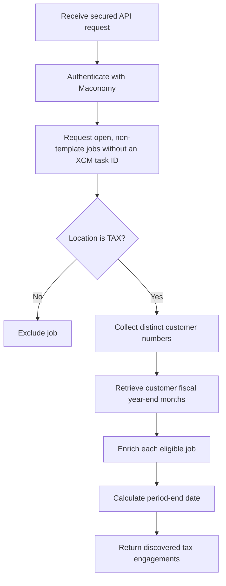

# XCM/CCH Axcess Integration

## Integration overview

This is the new XCM/CCH Axcess integration.

The integration will synchronize eligible tax engagements from Maconomy into
CCH. The work is being implemented in parts. The first part currently available
is the discovery of Maconomy tax engagements that are candidates for syncing
into CCH.

## Part 1: Discover tax engagements to sync into CCH

### Purpose

Part 1 identifies open, non-template TAX jobs in Maconomy that do not yet have
an XCM task identifier. It then enriches those jobs with the customer's fiscal
year-end month and calculates the engagement period-end date.

This part performs discovery and data preparation only. It does not currently
search, create, or update anything in CCH/XCM.

### API endpoint

```http
POST /api/v1/xcm-cch-axcess/maconomy-tax-engagements/pending-cch-task-mapping
X-API-KEY: <api-key>
```

The endpoint is registered in the FastAPI application and requires the standard
API-key authentication used by the integration service.

If communication with Maconomy fails, the endpoint returns HTTP `502 Bad
Gateway` with the message:

```text
Unable to retrieve pending tax engagements from Maconomy
```

### Current processing flow



### Maconomy authentication

The service authenticates with the configured Maconomy instance using the
Maconomy username and password. It obtains an `X-Reconnect` token and uses that
token for the job and customer requests.

The following application settings are used:

- `MACONOMY_BASE_URL`
- `MACONOMY_SHORTNAME`
- `MACONOMY_USERNAME`
- `MACONOMY_PASSWORD`

### Job discovery

The service calls the Maconomy `jobs/filter` endpoint and requests the following
fields:

| Field | Usage |
|---|---|
| `jobnumber` | Identifies the Maconomy engagement |
| `locationname` | Determines whether the engagement belongs to TAX |
| `customernumber` | Used to retrieve customer information |
| `specification2` | Provides the CCH task type for later task matching or creation |
| `theyear` | Used to calculate the period-end date |
| `text20` | Holds the existing XCM task identifier, when present |
| `date5` | Holds the existing stored Period End Date, when present |
| `createddate` | Used by the current discovery date restriction |
| `changeddate` | Returned for future changed-engagement processing |
| `closed` | Excludes closed jobs |
| `template` | Excludes template jobs |
| `versionnumber` | Returned for possible future change tracking |

The Maconomy request currently restricts the result to:

- Non-template jobs
- Open jobs
- Jobs within the configured created-date expression
- Jobs whose `text20` value is empty
- A maximum of 2,000 records

After receiving the records, the service performs an additional application-side
check. An engagement is eligible only when:

- `closed` is `false`.
- `locationname` is exactly `TAX`, using a case-insensitive comparison.
- The `text20` field exists.
- `text20` is `null` or an empty string.

### Customer enrichment

The service gathers the distinct, non-empty customer numbers from the eligible
jobs. It makes one request to the Maconomy `customercard/filter` endpoint using
an `or` restriction for those customer numbers.

The customer request retrieves:

- `customernumber`
- `fiscalyearendmonth`

The returned customers are indexed by customer number, and the corresponding
`fiscalyearendmonth` is added to each engagement. If the customer cannot be
matched, the fiscal year-end month is returned as `null`.

### Period-end-date calculation

The service calculates `periodenddate` from:

- The job's `theyear`
- The customer's `fiscalyearendmonth`

The fiscal year-end month may be a numeric month, a complete month name, or an
abbreviated month name. The result is the final calendar day of that month in
`MM/DD/YYYY` format.

Examples:

| Year | Fiscal year-end month | Period-end date |
|---:|---|---|
| 2025 | `6` | `06/30/2025` |
| 2024 | `december` | `12/31/2024` |

If either value is absent or invalid, `periodenddate` is returned as `null`.

### Output

The endpoint returns a JSON array containing the original selected Maconomy job
fields plus:

- `fiscalyearendmonth`
- `periodenddate`

Example structure:

```json
[
  {
    "jobnumber": "12345",
    "locationname": "TAX",
    "customernumber": "C-100",
    "specification2": "1040",
    "theyear": 2026,
    "text20": "",
    "date5": null,
    "closed": false,
    "template": false,
    "fiscalyearendmonth": 12,
    "periodenddate": "12/31/2026"
  }
]
```

The exact response also includes other requested Maconomy fields when Maconomy
returns them.

## Current implementation status

The following work is complete for Part 1:

- Secured FastAPI endpoint
- Maconomy authentication and reconnect-token handling
- Retrieval of open, non-template, unsynced job candidates
- Retrieval of the job-level CCH task type from `specification2`
- Retrieval of the job-level stored Period End Date from `date5`
- Case-insensitive TAX-location validation
- Distinct-customer lookup
- Fiscal-year-end-month enrichment
- Period-end-date calculation
- Maconomy request and response error handling
- Automated unit tests for the principal discovery behavior

The focused automated test suite currently contains five passing tests.

## Not implemented in this part

Part 1 does not yet include:

- CCH/XCM authentication or API calls
- CCH client or task matching
- CCH/XCM task creation or updates
- Writing a task identifier to Maconomy `text20`
- Database mappings
- Integration/audit logs
- Retry or reconciliation processing
- A queue or hand-off to the next integration part
- Watermark storage
- Processing based on `changeddate`
- Pagination beyond 2,000 jobs
- A scheduler registration for this new integration

The endpoint must currently be invoked directly. Although the application has a
general scheduler, Part 1 of this new integration has not been registered with
it.

## Known implementation concerns

### Created-date expression

The lower bound of the job date restriction currently uses
`start_date.month - 5`. This does not represent the previous calendar day's
month and can generate zero or negative month values from January through May.
The implementation and its test currently contain the same expression, so this
needs confirmation or correction before relying on the date window in a live
sync.

### Empty versus null task identifier

The Maconomy-side restriction uses `text20=''`, while the application-side
eligibility check accepts both an empty string and `null`. Whether jobs with a
null `text20` reach the application depends on the behavior of the Maconomy
filter API and should be verified against the target instance.

## Source location

The new integration is implemented under:

```text
backend/app/features/xcm_cch_axcess_integration
```

Future documentation and diagrams for this integration should remain in this
documentation directory. Images and other media files should be stored in the
`assets` subdirectory.
