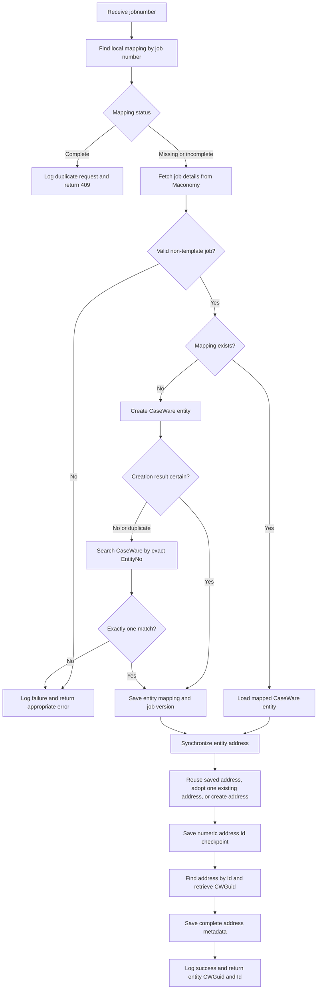

# On-Create Engagement Workflow

This endpoint creates one CaseWare Cloud entity and its address from a Maconomy
job. It also resumes incomplete synchronization and reconciles an entity when a
previous CaseWare creation result was uncertain.

Endpoint:
`POST /api/v1/caseware-cloud/on-create-engagement-post`

## Main rules

- The request requires an API key and a non-empty `jobnumber`.
- The mapping table is the source of truth for deciding whether a job has
  already been synchronized.
- A complete mapping returns `409 Conflict`. An incomplete mapping resumes from
  its saved state instead of creating another entity.
- Maconomy customer and address values come directly from the job-detail
  response. No separate customer API request is made.
- Template jobs are rejected and are not created or updated in CaseWare Cloud.
- If entity creation times out, returns an invalid response, or reports a
  duplicate-style failure, CaseWare is searched using the exact Maconomy job
  number as `EntityNo`.
- Reconciliation continues only when exactly one matching entity is found. No
  match remains a creation failure; multiple matches require manual resolution.
- Address creation returns a numeric `Id`. That ID is saved immediately before
  the address list is queried to obtain its `CWGuid`.
- A later request can recover an incomplete address by using the saved address
  ID or, when no ID was saved, by adopting the entity's single existing address.
  Multiple existing addresses require manual resolution.
- A successful response contains the CaseWare entity `CWGuid` and numeric `Id`.
