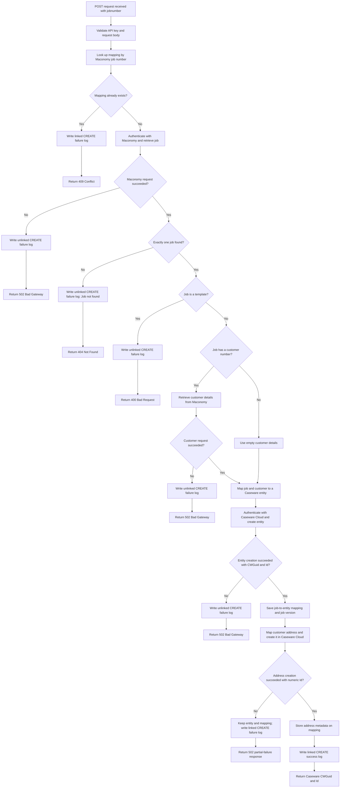

# On-Create Engagement Functional Workflow

This diagram shows the functional workflow for creating one Caseware Cloud
entity and address from a Maconomy job number.

## Functional rules

- The request body must contain a non-empty `jobnumber`, and the router requires
  an accepted API key.
- Duplicate detection uses the entity-engagement mapping table, not the
  integration-log table. A duplicate request is logged against its existing
  mapping and rejected.
- A Maconomy job must resolve to exactly one record and must not have
  `template = true`.
- Customer lookup only runs when the job has a customer number. No customer
  number, or a successful lookup with no matching customer, results in empty
  customer details and does not by itself stop entity creation.
- The Caseware entity mapper requires both `jobnumber` and `jobname`.
- The mapping is committed immediately after entity creation, before address
  creation. Consequently, an address failure leaves the entity and mapping in
  place and makes a retry of this endpoint fail the duplicate check.
- A successful response contains the `CWGuid` and numeric `Id` returned by
  Caseware Cloud.

Endpoint:
`POST /api/v1/caseware-cloud/on-create-engagement-post`
