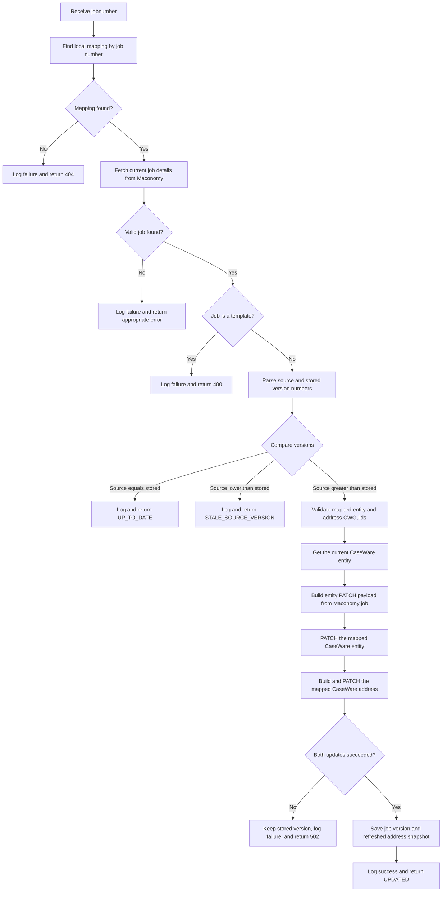

# On-Update Engagement Workflow

This endpoint checks whether a mapped Maconomy job has a newer version and, when
required, updates the corresponding CaseWare Cloud entity and address.

Endpoint:
`POST /api/v1/caseware-cloud/on-update-engagement-post`

## Main rules

- The request requires an API key and a non-empty `jobnumber`.
- A mapping must already exist for the Maconomy job. Missing mappings return
  `404 Not Found`; the update workflow does not create entities.
- The job is fetched directly by job number. The update decision does not use a
  `changeddate` restriction.
- Template jobs are rejected and are not updated in CaseWare Cloud.
- Both the Maconomy and stored `versionnumber` values must be non-negative
  integers.
- Equal versions return `UP_TO_DATE` without calling the CaseWare update API.
- A Maconomy version lower than the stored version returns
  `STALE_SOURCE_VERSION` without changing CaseWare or the mapping.
- A Maconomy version greater than the stored version triggers the CaseWare
  update.
- Before PATCHing, the service retrieves the current CaseWare entity and
  verifies that its returned `CWGuid` matches the GUID stored in the mapping.
- The entity PATCH synchronizes `Name`, `OperatingName`, `OwnerType`, and `Type`
  from the established entity mapping rules.
- The address mapping must contain exactly one address with a non-empty
  `caseware_cw_guid`.
- The address PATCH synchronizes `Address1`, `AddressCategory`, `City`,
  `Country`, and `Name` from the Maconomy job details.
- The stored Maconomy version and refreshed address snapshot are committed only
  after both CaseWare PATCH requests succeed. A failure leaves the job version
  unchanged so a later request can retry the complete update.

## Successful response statuses

- `UPDATED`: CaseWare was updated and the new version was saved.
- `UP_TO_DATE`: Maconomy and the mapping already have the same version.
- `STALE_SOURCE_VERSION`: Maconomy returned a version lower than the stored
  mapping version.
