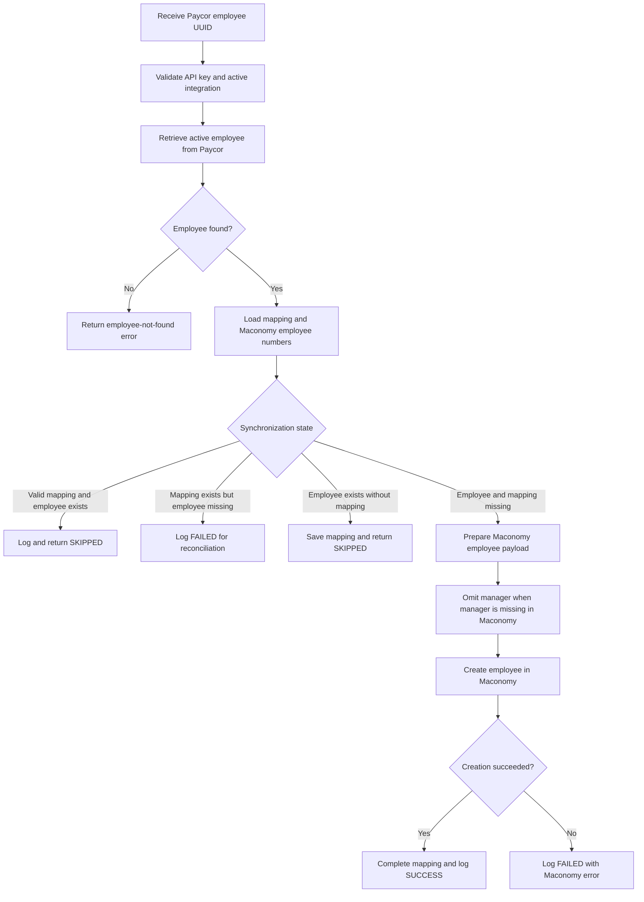

# Manual Paycor Employee Synchronization Workflow

This endpoint synchronizes one active Paycor employee with Maconomy using the
Paycor employee UUID. It prevents duplicate creation, reconciles existing
Maconomy employees, maintains the employee mapping, and records the result in
the integration log.

Endpoint:
`POST /api/v1/paycor/employees/{paycor_employee_id}/sync-with-maconomy`

## Main rules

- The endpoint requires an API key and an active Paycor integration service.
- The path parameter must be the top-level Paycor employee UUID, not the person
  ID, employee number, manager ID, or onboarding employee ID.
- Only employees returned by the configured Paycor legal entity with
  `statusFilter=Active` can be synchronized.
- Paycor `employeeNumber` is used as Maconomy `employeenumber`.
- The Paycor employee UUID is stored in Maconomy `text10`.
- The mapping table identifies the relationship between the Paycor employee and
  the Maconomy employee.
- A completed mapping is skipped only when the mapped employee number exists in
  Maconomy.
- A mapping that points to a missing Maconomy employee is treated as a failed
  reconciliation case.
- If the employee already exists in Maconomy without a mapping, the mapping is
  created and employee creation is skipped.
- The manager is sent as `superioremployee` only when that manager number exists
  in Maconomy.
- Department, work location, company number, and company name are not currently
  sent because their mappings require client confirmation.
- Maconomy initialized/default values are preserved during employee creation.
- A Maconomy contact person with the same number can block employee creation.
  Such failures are logged and require manual data reconciliation.
- Every created, skipped, or failed operation is written to the integration log.
- A successful response contains the Paycor employee ID, Paycor employee number,
  Maconomy employee number, status, and message.