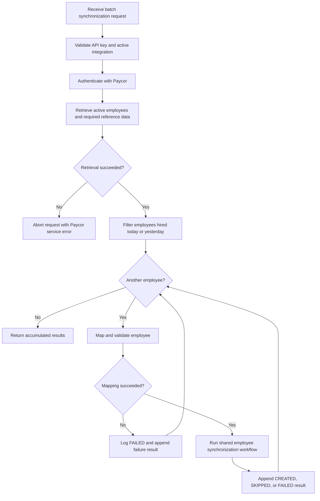
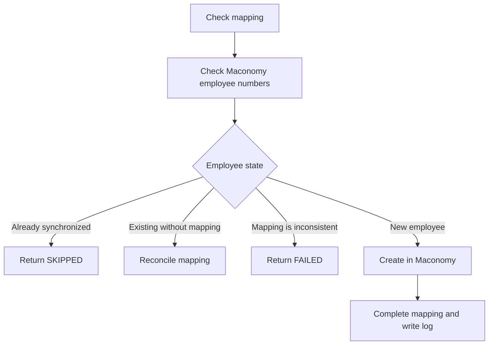

# Recent Paycor Hires Synchronization Workflow

This endpoint retrieves active Paycor employees hired today or yesterday and
synchronizes them with Maconomy one at a time. A failure for one employee does
not stop the remaining employees from being processed.

Endpoint:
`POST /api/v1/paycor/sync-recent-hires-with-maconomy`

## Per-employee synchronization

For every eligible employee, the endpoint uses the same synchronization logic
as the manual employee endpoint:

## Functional rules

- The endpoint requires an API key and an active Paycor integration service.
- Paycor employees are retrieved using the configured legal entity.
- Only active employees are retrieved.
- Employees are filtered using `hireDate` for today or yesterday in UTC.
- This is a calendar-date filter, not an employee-created timestamp filter.
- An empty eligible result returns an empty JSON array.
- Existing Maconomy employee numbers are loaded once before processing the
  batch.
- Employees are processed one at a time.
- A mapping or creation failure for one employee is logged and converted into a
  `FAILED` result.
- Processing continues with the next employee after a per-employee failure.
- A failure while initially retrieving Paycor or Maconomy data occurs before the
  loop and aborts the complete request.
- Duplicate employees are not created.
- Employees already present in Maconomy can have their local mapping reconciled.
- Successful creation completes the mapping only after Maconomy returns the
  expected employee number.
- Each result contains the Paycor employee ID, Paycor employee number, status,
  Maconomy employee number, and message.
- Possible result statuses are `CREATED`, `SKIPPED`, and `FAILED`.