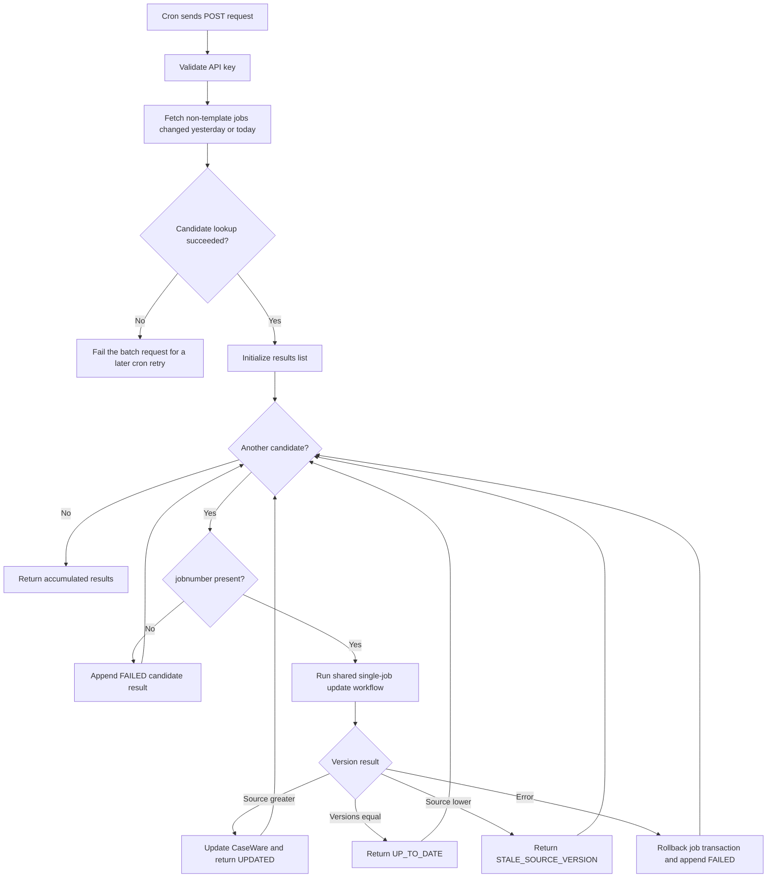

# Sync Recently Updated Maconomy Engagements

This endpoint is the scheduled batch workflow for detecting recently changed
Maconomy jobs and updating their mapped CaseWare Cloud entities and addresses.

Endpoint:
`POST /api/v1/caseware-cloud/sync-recently-updated-maconomy-engagements-with-caseware`

The endpoint is intended to be called by a non-overlapping cron job every five
minutes.



## Candidate selection

Maconomy is queried with the following business restriction:

```text
template=false
and changeddate>=yesterday
and changeddate<=today
```

The lookup returns `jobnumber`, `template`, and `versionnumber`, with a maximum
of 2,000 candidates. The expected business volume is approximately 10-20 jobs
per day.

The `changeddate` restriction only selects candidates. For every candidate, the
integration retrieves the full current job and compares its Maconomy
`versionnumber` with the version stored in the mapping table. This version
comparison is the authoritative update decision.

## Per-job rules

- Jobs are processed sequentially.
- The shared single-job update workflow requires an existing mapping. A missing
  mapping produces a `FAILED` result and does not create a CaseWare entity.
- Template validation and version validation are repeated using the full job
  details.
- `UPDATED` means the Maconomy version was greater, both CaseWare PATCH requests
  succeeded, and the job version and address snapshot were saved in the mapping.
- `UP_TO_DATE` means the source and stored versions were equal; CaseWare was not
  called for an update.
- `STALE_SOURCE_VERSION` means Maconomy returned a lower version; CaseWare and
  the mapping were not changed.
- A per-job error produces `FAILED`. The database session is rolled back before
  processing the next candidate, while previously committed logs and mappings
  remain unchanged.
- If CaseWare fails, the stored version is not advanced, allowing the next cron
  run to retry the job.
- The address update uses the `caseware_cw_guid` saved in the mapping during
  creation. A missing or invalid address mapping produces a `FAILED` result.

## Batch response

The endpoint returns one result object per candidate. Successful decisions use
one of these statuses:

- `UPDATED`
- `UP_TO_DATE`
- `STALE_SOURCE_VERSION`

Failures use `FAILED` and include an error message. An empty candidate set
returns an empty JSON array.
