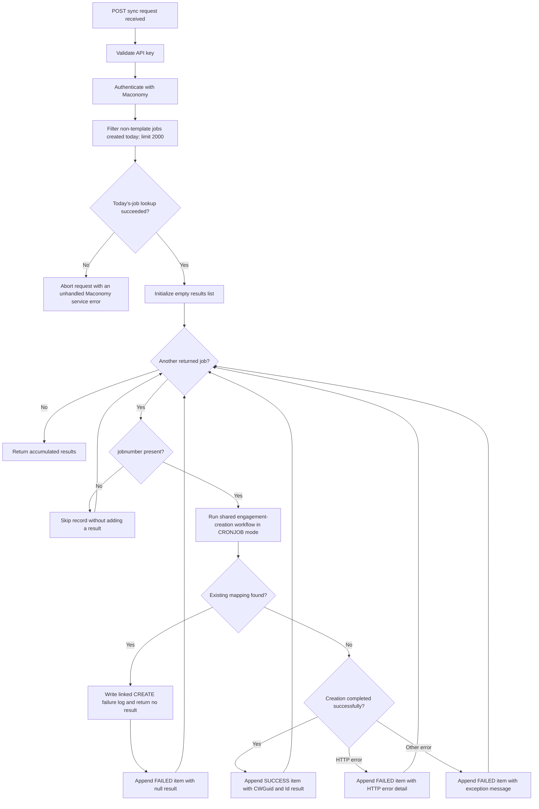
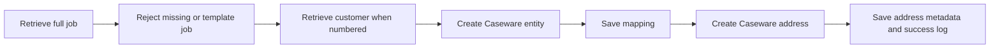

# Sync Today's Maconomy Engagements Functional Workflow

This diagram shows the batch workflow for finding Maconomy jobs created today
and creating the corresponding entities and addresses in Caseware Cloud.

## Per-job creation workflow

For every job number that does not already have a mapping, the endpoint calls
the same creation logic as `on-create-engagement-post`:

Failures in this per-job flow are logged by the shared creation logic and are
also converted into a `FAILED` item in the batch response. Processing then
continues with the next returned Maconomy job.

## Functional rules

- The initial Maconomy filter selects `template = false` jobs whose
  `createddate` is today according to the application server's local date, with
  a maximum of 2,000 records.
- An empty Maconomy result returns an empty JSON array.
- Records without `jobnumber` are silently skipped and do not appear in the
  response.
- Duplicate mappings are logged as failures. In `CRONJOB` mode they do not
  raise `409`; instead, the batch item has `status: "FAILED"` and
  `result: null`.
- A successful item has `job_number`, `status: "SUCCESS"`, and `result`
  containing the Caseware `CWGuid` and `Id`.
- A failed item caused by an HTTP error has `job_number`, `status: "FAILED"`,
  and `message`. Duplicate failures are the exception and use `result: null`.
- Per-job failures do not stop the batch. However, a failure while initially
  retrieving today's jobs occurs before the loop and aborts the whole request.
- Entity creation is committed before address creation. An address failure can
  therefore leave a created entity and mapping even though that batch item is
  reported as failed.

Endpoint:
`POST /api/v1/caseware-cloud/sync-todays-created-maconomy-engagements-with-caseware`
